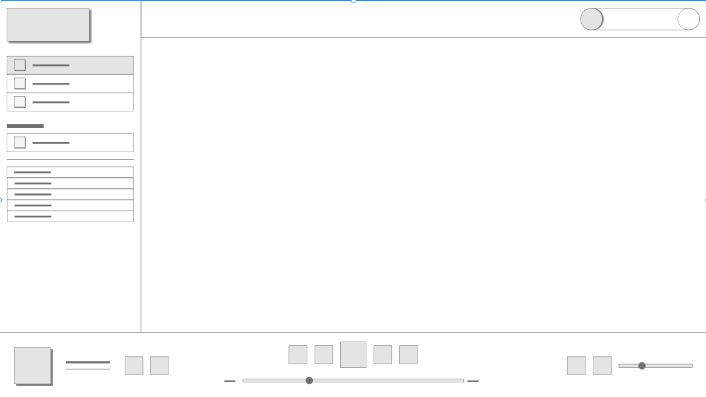
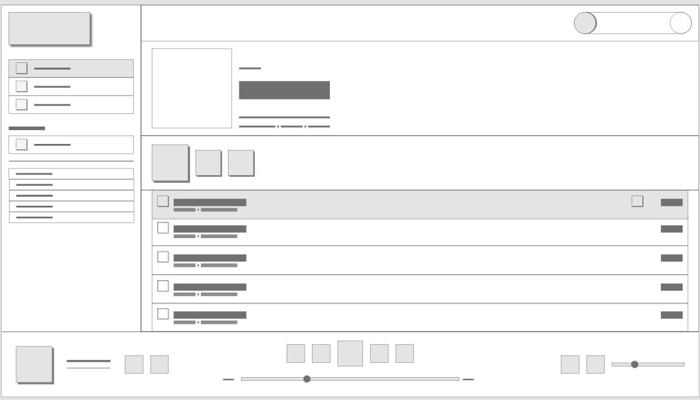

# VueJS Spotify Player Clone

A project represents a clone of the spotify player with using VueJS, Vuex, vue-router and Spotify API.

## Wireframes and Designs

<div align="center" style="margin:20px;">
	
	
	
</div>

## Featured Technologies
```
- VueJS Framework
- Vuex and vue-router
- Spotify API
- JS wrapper library for communicating with Spotify API
```