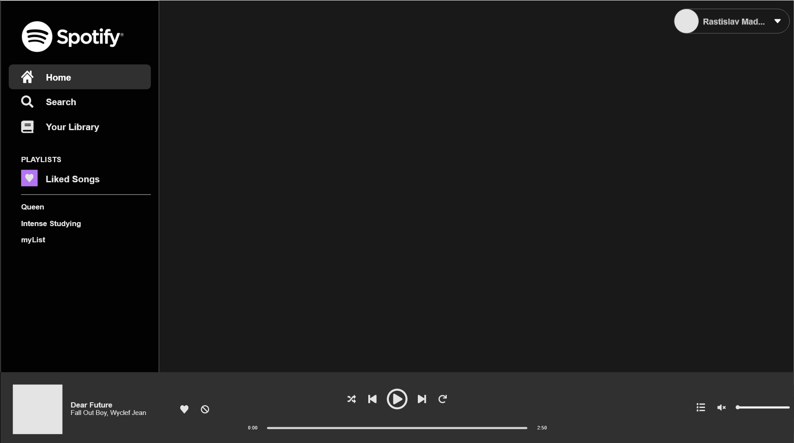

# VueJS Spotify Player Clone

A project represents a clone of the spotify player with using VueJS, Vuex, vue-router and Spotify API.

## Prototypes and Designs

<div style="display: flex; justify-content: space-between">
    <div style="margin: 10px; ">
        
        <p style="padding: 0 5px">Prototype of Spotify Player Dashboard<p>
    </div>
    <div style="margin: 10px">
        
        <p style="padding: 0 5px">Prototype of Spotify Player Playlist<p>
    </div>
</div>
<div style="display: flex; justify-content: space-between">
    <div style="margin: 10px">
        
        <p style="padding: 0 5px">Design of Spotify Player Dashboard in Adobe XD<p>
    </div>
</div>

## Featured Technologies
```
- VueJS Framework
- Vuex and vue-router
- Spotify API
- JS wrapper library for communicating with Spotify API
```